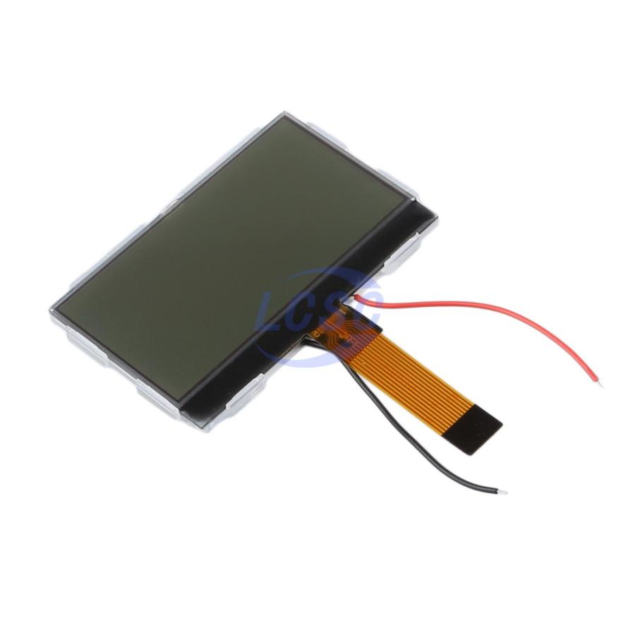
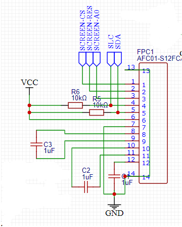

# HS12864TG10B-Lib

An Arduino IDE library to drive HS12864TG10B, a ST7567-Based LCD avaiable at [LCSC.com](https://www.lcsc.com/product-detail/LCD-Screen_HS-HS12864TG10B_C18198252.html). Great for low-power devices. 
(Note: this ins't any kind of official library, no warranty and those things)

No need for SPI hardware (couldn't make it work with it, idk why). Tested on ESP32-S3, but im sure it will work at least in every MCU in the ESP family. 

It needs Adafruit GFX to work, to draw shapes, icons, text, and stuff like that. There are some examples avaiable and some use instructions below.

## General Use

**Declaration of the screen:**

    HS12864TG10B display(PIN_SDA, PIN_SCK, PIN_CS, PIN_A0, PIN_RST);

Use this to create an instance of the screen. You need to provide the five comunication pins of the screen. As far as i've checked, all of them are necesary to run it, even the reset one.

**Initializing the display.**

    display.init();
This will send all the setup commands to the screen.

**Flipping the display**

    display.flip(bool);
This flips the display upside down. You can call this whenever you want, is a software thing. Hardware fliping will be implemented soon. Note, this is here because the rotate method from adafruit gfx doesnt work, so don't waste time trying it.

**Sending Data to the display**

Clear the display buffer:

    display.clearDisplay();

Send the dispaly buffer:

`display.display();`  or  `display.updateDisplay();`

it does literally the same, so use the one you like the most.

**Drawing Things**

To draw thing, you can use anything from the AdafruitGFX library, such as `display.fillRect()` or `display.println()`

*Colors*

This is a monochrome screen, so there are only two colors, black and white. You can use 1 and 0 respectively, or use `HS12864_BLACK` and `HS12864_WHITE` , like the SSD1306 library.

`HS12864_INVERSE` is also avaiable. It wil, obviusly, invert that pixel. You can replace it with a 2

 
**Contrast Config**

you can change the contrast of the LCD whenever you want, just use 

    display.setContrast(88);
It gets values from 0 to 255. 

**Example Schematic**

Please note that the connector is flipped compared to the datasheet and the pin numeration in the LCD connector. Connector flip depends on the manufacturer of the conector and the footprint desingner. Manually check if you should flip your connector.
